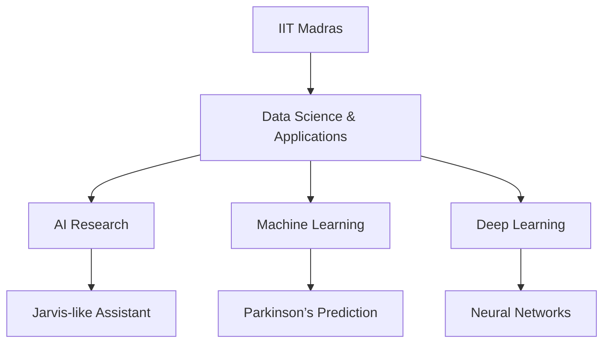

<div align="center">

<!-- Fixed animated typing header -->


<!-- Modern gradient badge links -->
<p align="center">
  <a href="https://shivayadav.netlify.app/">
    
  </a>
  <a href="https://www.linkedin.com/in/shiva-yadav-4043912b9/">
    
  </a>
  <a href="https://github.com/shiva-yadav-ds">
    
  </a>
  <a href="https://orcid.org/0009-0003-8089-3848">
    
  </a>
  <a href="https://www.instagram.com/shiva.datascience">
    
  </a>
  <a href="https://www.youtube.com/@noisegaming678">
    
  </a>
</p>

<!-- Fixed view counter -->
<p align="center">
  
</p>

<!-- Fixed snake animation -->


</div>

## 🔮 About Me



🎓 Student at IIT Madras - Data Science & Applications

🤖 Building AI Assistant (Jarvis-like)

🧠 Researching Parkinson's Disease Prediction

📊 Proficient in Python, TensorFlow, Scikit-Learn

🧬 Exploring Bioinformatics & Health Tech

🚀 GitHub Highlights
<div align="center"><!-- Fixed achievement badges --><p align="center">  </p></div>
📊 Dynamic Stats
<div align="center"><!-- Fixed stats with proper theming --><a href="https://github.com/shiva-yadav-ds">   </a><!-- Fixed streak stats --><!-- Fixed activity graph --></div>
🧰 Tech Stack
<!-- Fixed icons for dark mode --><p align="center">  <br>  </p>
🎥 YouTube Content
<!-- Fixed YouTube cards --><div align="center"> <a href="https://www.youtube.com/@noisegaming678">  </a> <a href="https://youtube.com/shorts/...">  </a> <a href="https://youtube.com/shorts/...">  </a> </div>
📬 Let's Connect
<p align="center"> <a href="mailto:yaduvanshishubha678@gmail.com">  </a> <a href="https://shivayadav.netlify.app/">  </a> <a href="https://www.linkedin.com/in/shiva-yadav-4043912b9/">  </a> </p><div align="center"><!-- Fixed animated quote --></div> ```
