<!-- Fixed animated typing header -->

<!-- Modern gradient badge links -->

  
  
  
  
  
  

<!-- Fixed view counter -->

  

<!-- Fixed snake animation -->
<picture>
  <source media="(prefers-color-scheme: dark)" srcset="https://raw.githubusercontent.com/shiva-yadav-ds/shiva-yadav-ds/output/github-contribution-grid-snake-dark.svg" />
  <source media="(prefers-color-scheme: light)" srcset="https://raw.githubusercontent.com/shiva-yadav-ds/shiva-yadav-ds/output/github-contribution-grid-snake.svg" />
  
</picture>

## 🔮 About Me

```mermaid
graph TD
    A[IIT Madras] --> B[Data Science & Applications]
    B --> C[AI Research]
    B --> D[Machine Learning]
    B --> E[Deep Learning]
    C --> F[Jarvis-like Assistant]
    D --> G[Parkinson’s Prediction]
    E --> H[Neural Networks]
```

🎓 Student at IIT Madras - Data Science & Applications

🤖 Building AI Assistant (Jarvis-like)

🧠 Researching Parkinson's Disease Prediction

📊 Proficient in Python, TensorFlow, Scikit-Learn

🧬 Exploring Bioinformatics & Health Tech

## 🚀 GitHub Highlights

  

## 📊 Dynamic Stats

  
   
  
   
  

## ⚡ Tech Stack & Tools

  
  
  
  
  
  
  
  
  
  
  
  
  
  
  
  
  
  
  

## 📬 Let's Connect

  
  
  

  

