<!-- Modern gradient typing header -->

<!-- Minimalist badge links with hover effects -->

  
  
   
  
  
  
  

<!-- Modern view counter -->

  

## 🚀 About Me

```mermaid
graph LR
    A[IIT Madras] --> B[Data Science]
    B --> C[AI Research]
    B --> D[ML Engineering]
    B --> E[Deep Learning]
    C --> F[Voice Assistant]
    D --> G[Parkinson’s Prediction]
    E --> H[Neural Networks]
```

🎓 Data Science student at IIT Madras

🤖 Building JARVIS-like AI assistant with voice integration

🧠 Researching Parkinson's prediction using ML/DL

📊 Proficient in Python, TensorFlow, PyTorch

🧬 Exploring bioinformatics & health tech applications

## 🔥 GitHub Highlights

  <!-- Stats cards in a single row -->
  

    
    
  

  
  <!-- Trophies with better spacing -->
  

    
  

  
  <!-- Streak stats with consistent styling -->
  

  

## 🛠️ Tech Stack

  <!-- Data Science Tools -->
  
  
  
  

  <!-- Development Tools -->
  
  
  
  

  <!-- Other Tools -->
  
  
  
  

## 🌐 Connect With Me

      

<!-- Inspirational Indian Quote -->

  <blockquote>
    <em>"Dream is not that which you see while sleeping, it is something that does not let you sleep."</em> 
    — Dr. A.P.J. Abdul Kalam
  </blockquote>

