<div align="center">

<!-- Modern gradient typing header -->


<!-- Minimalist badge links with hover effects -->
<div align="center" style="margin: 20px 0;">
  <a href="https://shivayadav.netlify.app/" target="_blank">
    
  </a>
  <a href="https://www.linkedin.com/in/shiva-yadav-4043912b9/" target="_blank">
    
  </a>
  <a href="https://github.com/shiva-yadav-ds" target="_blank">
    
  </a>
  <a href="https://orcid.org/0009-0003-8089-3848" target="_blank">
    
  </a>
  <a href="https://www.youtube.com/@noisegaming678" target="_blank">
    
  </a>
  <a href="https://www.kaggle.com/shivayadavds" target="_blank">
    
  </a>
</div>

<!-- Modern view counter -->
<p align="center">
  
</p>

</div>

## 🚀 About Me

```mermaid
graph LR
    A[IIT Madras] --> B[Data Science]
    B --> C[AI Research]
    B --> D[ML Engineering]
    B --> E[Deep Learning]
    C --> F[Voice Assistant]
    D --> G[Parkinson’s Prediction]
    E --> H[Neural Networks]
```



🎓 Data Science student at IIT Madras

🤖 Building JARVIS-like AI assistant with voice integration

🧠 Researching Parkinson's prediction using ML/DL

📊 Proficient in Python, TensorFlow, PyTorch

🧬 Exploring bioinformatics & health tech applications

🔥 GitHub Highlights
<div align="center">
	
</div><div align="center">   </div>
🛠️ Tech Stack
🔬 Data Science
https://img.shields.io/badge/-Python-0F172A?logo=python&logoColor=38BDF8
https://img.shields.io/badge/-TensorFlow-0F172A?logo=tensorflow
https://img.shields.io/badge/-PyTorch-0F172A?logo=pytorch
https://img.shields.io/badge/-Scikit_Learn-0F172A?logo=scikitlearn

💻 Development
https://img.shields.io/badge/-React-0F172A?logo=react
https://img.shields.io/badge/-Node.js-0F172A?logo=nodedotjs
https://img.shields.io/badge/-MongoDB-0F172A?logo=mongodb
https://img.shields.io/badge/-MySQL-0F172A?logo=mysql

⚙️ Tools
https://img.shields.io/badge/-Git-0F172A?logo=git
https://img.shields.io/badge/-Docker-0F172A?logo=docker
https://img.shields.io/badge/-Linux-0F172A?logo=linux
https://img.shields.io/badge/-Jupyter-0F172A?logo=jupyter

🌐 Connect With Me
<p align="center"> <a href="mailto:yaduvanshishubha678@gmail.com">  </a> <a href="https://shivayadav.netlify.app/">  </a> <a href="https://www.linkedin.com/in/shiva-yadav-4043912b9/">  </a> <a href="https://www.youtube.com/@noisegaming678">  </a> <a href="https://www.kaggle.com/shivayadavds">  </a> </p><div align="center" style="margin-top:30px">  </div> ```
